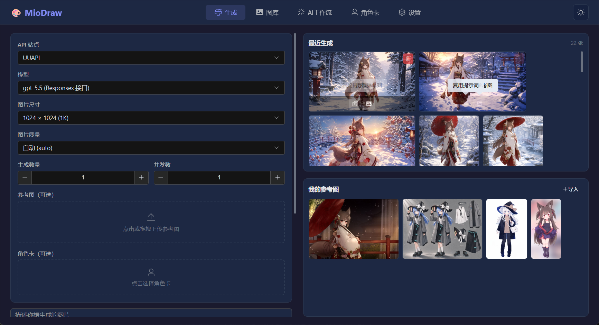
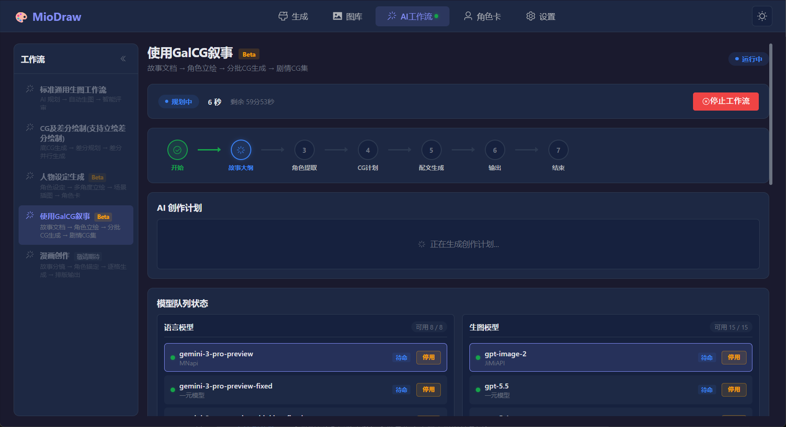

<div align="center">


### MioDraw：你的私人 AI 绘图与灵感优化本地工作站

一款致力于简单、高效的使用API生图模式为主的 AI 绘图与提示词优化本地工作站

[](https://opensource.org/licenses/MIT)
[](https://github.com/Fox-Fox-Mio/MioDraw/releases)
[](#)
[](https://github.com/Fox-Fox-Mio/MioDraw/releases)

[**直接下载 (Releases)**](https://github.com/Fox-Fox-Mio/MioDraw/releases) · [**使用说明文档**](#) · [**报告 Bug**](https://github.com/Fox-Fox-Mio/MioDraw/issues)

</div>

---

## 写在前面
1. 如果你想要快速开始，直接进入 Releases 页面下载就行哦，软件内包含完整使用说明文档
2. 本软件 80% 以上代码使用 AI 工具开发，如果您不能接受，请不要下载本软件 qwq
3. 本软件是作者的第一个开源项目，因此项目维护、整体管理都是新手水平，还请多多包涵，勿喷 QAQ
4. 由于作者学业原因，本项目后续更新/维护可能会较为缓慢，见谅
5. 欢迎加入狐狐澪的 QQ 交流群：1082998626 共同聊天与讨论哦 qwq

## 为什么选择 MioDraw？

在网页端生图受限于网络波动？云端图库管理混乱且隐私无法保障？不会写复杂的 AI 提示词？想把自己写的故事变成画面却无从下手？

**MioDraw** 专为解决这些痛点而生，原生运行于你的桌面，提供极致的性能与隐私保护，V1.0.0新增AI工作流模式，把你自己的故事变成专属的CG剧情集。

---

## 核心特性 (Features)

### 🎨 1. 极致生图体验，多节点并发
- **灵活配置**：支持自由配置多个 API 站点（兼容 OpenAI 格式及各类中转接口）。
- **多接口适配**：原生支持 图片模型 (/images/generations)、Chat 模型 (/chat/completions) 与 Responses 接口，并支持自定义接口类型。
- **多张参考图**：所有接口均支持多张参考图上传（含拖拽上传）。
- **并发控制**：强大的任务系统，实时监控每个并发任务的进度与耗时，支持随时**一键物理打断**。
- **累计任务模式**：可连续提交多批次生成任务，各批次独立运行和中止，同时执行上限 10 个任务。
- **精准作画**：提供从 1K 到 4K 的十余种主流画幅比例预设（支持自定义），并支持角色卡集成。

<div align="center">
  
</div>

### 🎨 2. 全栈 AI 自动化工作流
全新的核心功能——让 AI 不仅帮你画图，还帮你**思考、规划、评审和迭代**。

- **标准生图工作流**：AI 生成创作计划 → 逐张并发生图 → AI 自动评审打分 → 迭代优化直到满意。
- **CG 及差分绘制**：从零生成底 CG + 多张表情/动作差分，或上传已有底图仅生成差分。4路 Worker 并行，审核互斥锁保证交互有序。
- **人物设定生成** (Beta)：输入角色概念 → AI 自动生成正面锚定图、表情差分、侧面/背面立绘、场景插图 → 结构化文档 → 一键导入角色卡。
- **GalCG 叙事** (Beta)：上传一篇故事（.txt/.md/.docx）→ AI 压缩大纲、提取角色、生成立绘 → 分批规划 CG → 自动生成全部剧情 CG，支持旁白/配文系统、画风选择、纯 CG 模式。

**工作流通用能力**：
- ⚡ 模型故障转移（连续失败自动停用，切换下一个）
- ⚡ 效率优先模式（所有图并行生成，ModelSlotManager 智能调度）
- ⚡ 节点流可视化（实时状态更新）
- ⚡ 后台运行（切换页面不中断，导航栏绿色呼吸点指示）
- ⚡ 提示音通知（支持自定义音频）
- ⚡ 超时延长机制（时间耗尽可选择延长 10min~6h）

<div align="center">
  
</div>

### 🎨 3. 角色卡管理系统
创造和管理你的角色，并在生图时一键注入。

- **角色卡 CRUD**：新建（主设图 + 名称）、编辑、删除、收藏、批量管理。
- **丰富字段**：基础设定、外观描述、性格特点、经历与故事（支持拖拽排序），各字段支持 AI 一键生成。
- **角色画廊**：独立于主图库的画集，支持复制/剪切、上传、导出、删除。
- **生图集成**：生图页面选择角色卡后，主设图自动注入参考图 + 角色信息缝合进提示词。
- **导出分享**：支持导出为 JSON/TXT 文件，可选导出内容，实时预览 + 一键复制。

### 🎨 4. 本地图库，隐私无忧
- **数据安全**：所有配置、API Key（AES-256 加密）与生成的图片**完全保存在本地文件系统**，绝无云端上传。
- **丝滑浏览**：内置底层 C++ 缩略图加速，浏览几百张 4K 图片也毫无卡顿。
- **优雅管理**：支持"等比方格"与"瀑布流"双模式切换；支持新建相册、一键收藏、导出与重命名等。
- **批量操作**：统一批量管理模式，选中图片后一键批量导出/移动/收藏/删除。
- **数据迁移**：支持一键将海量图片数据无损迁移至其他盘。

### 🎨 5. AI 提示词优化助手
- **内置大模型对话**：拥有独立配置的 Chat 节点，支持流式输出与多模态（可上传图片附件）。
- **一键灵感爆发**：在生图界面遇到瓶颈？点击"一键优化"，AI 将根据你输入的短句，自动扩展为结构清晰、细节丰富的专业提示词。
- **双模式系统提示词**：生成页与工作流页使用不同的系统提示词，各取所长。
- **多会话管理**：左侧独立会话列表，支持历史记录保留、重命名与删除。

### ✨ 6. 本地离线超分 & 背景去除
- **高清超分**：深度集成 `Real-ESRGAN` 离线超分引擎，完全调用本地 GPU 算力，不消耗任何 API 额度，一键将低分辨率原图无损放大 2~4 倍。多种算法模型可选（二次元专属/真实摄影等）。
- **背景去除**：集成 `rembg`（Python Embedded 便携版 + ONNX 模型），模型按需下载，一键去除图片背景。
- **原图保护**：所有处理均新建记录，不覆盖原图。

### ✨ 7. 细节打磨
- **个性化外观**：支持暗色/亮色双主题，支持自定义全局半透明背景图。
- **参考图自动压缩**：参考图过大时自动压缩，避免请求失败（可自定义阈值或关闭）。
- **底层代理网络**：彻底告别浏览器跨域拦截（CORS），连接更稳定。
- **错误监控**：内置详尽的运行错误日志面板（错误自动展开详情）及常见报错对照手册，排障更轻松。
- **拖拽上传**：参考图、文档、底 CG、角色预设等区域均支持拖拽上传。

---

## 安装与运行 (Installation)

### 普通用户 (直接使用)
前往 [Releases 页面](https://github.com/Fox-Fox-Mio/MioDraw/releases) 下载最新版本的安装包：
- `MioDraw-Setup-xxx.exe`：标准安装向导版（推荐）
- `MioDraw-Portable-xxx.exe`：单文件便携版（直接下载点击即用，但稳定性未测试）
- `MioDraw-xxx.zip`：免安装绿色压缩包（直接下载一键解压即用，推荐）

### 开发者 (本地编译)
如果您想亲自修改代码或构建属于自己的版本：

#### 1. 克隆仓库
```code
git clone https://github.com/Fox-Fox-Mio/MioDraw.git
```

#### 2. 进入目录
```code
cd MioDraw
```

#### 3. 安装依赖 (推荐使用 npm 镜像加速)
```code
npm install
```

#### 4. 下载本地引擎（如果您的开发无需使用这些功能，可以跳过）
超分引擎：请前往 Real-ESRGAN 官方下载 Windows Vulkan 版本，放置于 resources/upscaler/ 目录下。

背景去除引擎：请准备 Python Embedded 便携版，放置于 resources/bg-remover/python/ 目录下，ONNX 模型会在首次使用时按需下载。

#### 5. 确认项目结构 (必做)
项目目录结构参考：
```text
MioDraw/
├── resources/
│   ├── upscaler/                       # Real-ESRGAN C++ 引擎与模型文件(可选)
│   └── bg-remover/                     # 背景去除引擎(可选)
│       ├── python/                     # Python Embedded 便携版(可选)
│       ├── models/                     # ONNX 模型(可选)
│       └── run_rembg.py                # 入口脚本(可选)
├── src/                                # Vue 3 渲染进程
│   ├── assets/styles/global.css, variables.css          # 样式文件 (global.css, variables.css)
│   ├── components/                     # 全局组件
│   │   ├── DisclaimerDialog.vue        # 免责声明弹窗
│   │   ├── ImageDetail.vue             # 图片详情（含放大预览、超分、去背景）
│   │   ├── LogViewer.vue               # 日志与报错对照
│   │   ├── ModelDownloadDialog.vue     # 模型下载选择弹窗
│   │   ├── ModelDownloadProgress.vue   # 右上角下载进度浮窗
│   │   ├── PromptAssistant.vue         # AI 对话与优化助手（多模态）
│   │   └── WorkflowDialogs.vue         # 工作流全局弹窗（含效率模式弹窗、角色处理弹窗、超时弹窗）
│   ├── layouts/MainLayout.vue          # 导航栏布局（含角色卡入口）
│   ├── router/index.js                 # 路由（含 /characters）
│   ├── pages/                          # 主页面
│   │   ├── CharacterPage.vue           # 角色卡管理页
│   │   ├── FullStackAIPage.vue         # 全栈AI工作流页
│   │   ├── GalleryPage.vue             # 图库页（含统一批量管理+批量导出）
│   │   ├── GeneratePage.vue            # 生成页（含角色卡集成+拖拽上传）
│   │   └── SettingsPage.vue            # 设置与 API 配置页
│   ├── stores/                         # Pinia
│   │   ├── api.js                      # 绘图 API 站点/Key/模型管理
│   │   ├── character.js                # 角色卡管理
│   │   ├── chat.js                     # 对话 API 站点/Key/模型管理
│   │   ├── gallery.js                  # 图库（生成图+导入图+批量操作）
│   │   ├── generation.js               # 生成任务状态（含累计任务模式）
│   │   ├── modelDownload.js            # 模型下载状态管理
│   │   ├── theme.js                    # 主题、布局、提示音等设置
│   │   └── workflow.js                 # 工作流状态（含GalCG阶段追踪ref、模型手动停用/恢复、时间延长）
│   └── utils/                          # 工具类
│       ├── cgDiffWorkflowEngine.js     # CG及差分绘制工作流引擎
│       ├── characterDesignEngine.js    # 人物设定生成工作流引擎
│       ├── chatApi.js                  # 封装的聊天请求与流式解析
│       ├── galCGWorkflowEngine.js      # GalCG叙事工作流引擎（V1.0.0 角色处理重构）
│       ├── imageApi.js                 # 封装的各类型绘图 API 请求（超时250秒）
│       ├── imageStorage.js             # 图片存取、miodraw://路径、超分、去背景
│       ├── logger.js                   # 全局日志记录
│       ├── notificationSound.js        # 提示音工具（默认音/自定义音/音量）
│       ├── storage.js                  # 本地存储双写与防抖
│       └── workflowEngine.js           # 标准生图工作流引擎
├── electron/                           # 主进程代码
│   ├── main.cjs                        # 核心控制与 IPC 通道（含文档解析、批量导出）
│   └── preload.cjs                     # ContextBridge
├── public/                             # 静态文件
│   ├── icon.ico                        # 应用图标
│   ├── logo.png                        # 启动屏 Logo
│   ├── narration-preview-sidebar.png   # 旁白样式预览图（右侧文本）
│   ├── narration-preview-embed.png     # 旁白样式预览图（嵌入文本）
│   └── splash.html                     # 启动屏页面（渐进式加载条）
├── vite.config.js                      # Vite 配置（含 optimizeDeps.exclude: ['mammoth']）
└── package.json                        # 构建与 electron-builder 配置
```

#### 6. 启动开发环境
```code
npm run dev
```

#### 7. 打包构建
```code
npm run build
```

## 免责声明 (Disclaimer)
本软件为免费开源的图形化桌面客户端，仅供个人学习、研究与交流使用，严禁用于任何商业营利目的。
本软件本身不包含、不提供任何云端大模型服务，用户需自行合法合规地配置第三方 API。
请用户严格遵守所在国家或地区的法律法规，严禁利用本软件生成、传播任何非法或违规内容，一切法律后果由用户自行承担。
详见软件以及使用手册内置的《MioDraw 软件免责声明》。

## 参与贡献 (Contributing)
非常欢迎任何形式的贡献！如果你有好的想法、发现了 Bug，或是改进了某些功能，请随时提交 Pull Request 或开启 Issue。也欢迎进群交流哦qwq

## 开源协议 (License)
本项目基于 [MIT License](LICENSE) 协议开源。